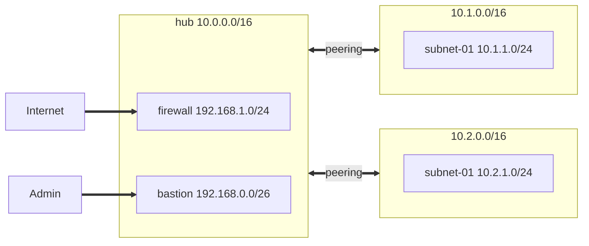

# Azure Hub and Spoke architecture with Azure Firewall

The project provisions an Azure network infrastructure using Terraform.
The goal of the project is to ensure connectivity to internal web servers through Azure Firewall using DNAT: TCP port 8080 is mapped to port 80 of one VM and port 8081 is mapped to port 80 of the second VM.

The infrastructure includes 3 virtual network in hub-and-sopke topology as follows:
- Hub virtual network which includes two specific subnets: Azure Firewall and Bastion (for administrative purposes)
- two spoke subnets, in each of it there is one Linux based VM which listens to port TCP 80
Both spoke virtual networks are connected to hub using pairing - the easiest vnet interconnection way if no other constraints are requested.

The project is modularized in order to allow as flexibility and reusability.
The network infrastructure is defined through locals mapping.

Connecivity to Vms is allowed only through Bastion, avoiding then any VM port exposure to Internet.
No password hardcoded as managedidentity and AADLogin extensions are configured on VMs.

# Architecture





---

# Validation
```bash
curl http://20.86.28.150:8080
Hello from 10.1.1.4
```


```bash
curl http://20.86.28.150:8081
Hello from 10.2.1.4
```

---

# Features
- Azure Virtual Network
- Multiple subnets
- Network Security Groups
- User Defined Routes (UDR)
- Linux VM
- Azure Firewall and firwall rules
- Azure Bastion

---

# Project Structure

```text
.
├__modules
|___bastion  => Creates Bastion with associated public IP
|___compute  => Creates VM
|___network  => Creates network infrastructure
|___firewall => Creates Azure firewall
|___routing  => Create user defined route and subnet associations
|__main.tf
|__outputs.tf
|__versions.tf
|__variables.tf
```

---

# Deployment

Initialize Terraform

```bash
terraform init
```

Validate configuration

```bash
terraform validate
```

Generate execution plan

```bash
terraform plan
```

Deploy infrastructure

```bash
terraform apply
```

Destroy infrastructure

```bash
terraform destroy
```

---

# Networking Design

The infrastructure is divided into three logical layers:

- **Frontend Subnet** hosts the Bastion virtual machine.
- **DMZ Subnet** hosts a Linux virtual machine configured as a Network Virtual Appliance with IP forwarding enabled.
- **Private Subnet** hosts an Apache web server without direct Internet access.

User Defined Routes redirect traffic from the frontend subnet to the Linux Network Virtual Appliance, which performs IP forwarding before forwarding packets to the backend subnet.

Network Security Groups restrict communication between subnets and enforce network segmentation.


---

# Learning Objectives

This project demonstrates practical knowledge of:

- Infrastructure as Code (Terraform)
- Azure Virtual Networking
- User Defined Routes
- Network Virtual Appliances
- Linux Virtual Machines
- Cloud-init
- Terraform variables and outputs
- Dynamic subnet creation using `for_each`
- Github Actions CI
- TFLing integration/Checkov /tfsec security scanning

---

# Future Improvements

- Azure Monitor & Log Analytics
- Cost dashboard
---

# Terraform Configuration Reference

The following section is automatically generated using **terraform-docs**.

<!-- BEGIN_TF_DOCS -->
## Requirements

| Name | Version |
| ---- | ------- |
| <a name="requirement_terraform"></a> [terraform](#requirement\_terraform) | >=1.9.0 |
| <a name="requirement_azurerm"></a> [azurerm](#requirement\_azurerm) | ~>4.81.0 |
| <a name="requirement_tls"></a> [tls](#requirement\_tls) | ~>4.3.0 |

## Providers

| Name | Version |
| ---- | ------- |
| <a name="provider_azurerm"></a> [azurerm](#provider\_azurerm) | 4.81.0 |
| <a name="provider_tls"></a> [tls](#provider\_tls) | 4.3.0 |

## Modules

| Name | Source | Version |
| ---- | ------ | ------- |
| <a name="module_bastion"></a> [bastion](#module\_bastion) | ./modules/bastion | n/a |
| <a name="module_firewall"></a> [firewall](#module\_firewall) | ./modules/firewall | n/a |
| <a name="module_routing"></a> [routing](#module\_routing) | ./modules/routing | n/a |
| <a name="module_vm"></a> [vm](#module\_vm) | ./modules/compute | n/a |
| <a name="module_vnet"></a> [vnet](#module\_vnet) | ./modules/network | n/a |

## Resources

| Name | Type |
| ---- | ---- |
| [azurerm_public_ip.public_ip](https://registry.terraform.io/providers/hashicorp/azurerm/latest/docs/resources/public_ip) | resource |
| [azurerm_resource_group.rg](https://registry.terraform.io/providers/hashicorp/azurerm/latest/docs/resources/resource_group) | resource |
| [azurerm_virtual_network_peering.hub_spokes](https://registry.terraform.io/providers/hashicorp/azurerm/latest/docs/resources/virtual_network_peering) | resource |
| [azurerm_virtual_network_peering.spokes_to_hub](https://registry.terraform.io/providers/hashicorp/azurerm/latest/docs/resources/virtual_network_peering) | resource |
| [tls_private_key.ssh_private_key](https://registry.terraform.io/providers/hashicorp/tls/latest/docs/resources/private_key) | resource |

## Inputs

| Name | Description | Type | Default | Required |
| ---- | ----------- | ---- | ------- | :------: |
| <a name="input_application_name"></a> [application\_name](#input\_application\_name) | n/a | `string` | n/a | yes |
| <a name="input_environment_name"></a> [environment\_name](#input\_environment\_name) | n/a | `string` | n/a | yes |
| <a name="input_location"></a> [location](#input\_location) | n/a | `string` | n/a | yes |

## Outputs

| Name | Description |
| ---- | ----------- |
| <a name="output_public_ip"></a> [public\_ip](#output\_public\_ip) | n/a |
<!-- END_TF_DOCS -->

---

# Author

This project is part of my Azure & Terraform portfolio and demonstrates Azure networking concepts, Infrastructure as Code, and secure network design using Terraform.