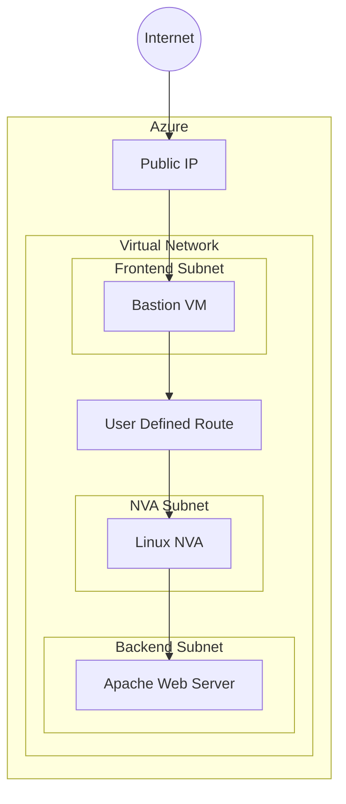

# Azure Secure Network with Network Virtual Appliance


Provision a secure Azure networking environment using Terraform, demonstrating how to route traffic through a Linux-based Network Virtual Appliance (NVA) while keeping backend resources isolated from direct Internet access.

The infrastructure includes a Bastion virtual machine for secure administration, User Defined Routes (UDRs), Network Security Groups (NSGs), and a private Apache web server provisioned using cloud-init.

The objective of this project is to ensure that all traffic between the Bastion VM and the private web server is routed through the Linux-based Network Virtual Appliance (NVA).


# Architecture



The Bastion VM is the only virtual machine exposed through a Public IP address.

Traffic destined for the backend subnet is redirected through the Linux-based Network Virtual Appliance using Azure User Defined Routes.

---

# Validation

From the Bastion VM, the private web server is reachable only through the Network Virtual Appliance.

```bash
curl http://192.168.3.4

Hello from 192.168.3.4

```

Packet forwarding can be verified on the Network Virtual Appliance using tcpdump.

```bash
sudo tcpdump -i any host 192.168.3.4
tcpdump: data link type LINUX_SLL2
tcpdump: verbose output suppressed, use -v[v]... for full protocol decode
listening on any, link-type LINUX_SLL2 (Linux cooked v2), snapshot length 262144 bytes
16:29:55.567438 eth0  In  IP vmapp01dev-bastion.internal.cloudapp.net > vmapp01dev-webapp.internal.cloudapp.net: ICMP echo request, id 1, seq 1, length 64
16:29:55.567476 eth0  Out IP vmapp01dev-bastion.internal.cloudapp.net > vmapp01dev-webapp.internal.cloudapp.net: ICMP echo request, id 1, seq 1, length 64
16:29:55.568346 eth0  In  IP vmapp01dev-webapp.internal.cloudapp.net > vmapp01dev-bastion.internal.cloudapp.net: ICMP echo reply, id 1, seq 1, length 64
16:29:55.568354 eth0  Out IP vmapp01dev-webapp.internal.cloudapp.net > vmapp01dev-bastion.internal.cloudapp.net: ICMP echo reply, id 1, seq 1, length 64

```

---

# Features
- Azure Virtual Network
- Multiple subnets
- Network Security Groups
- User Defined Routes (UDR)
- Linux Network Virtual Appliance (NVA)
- IP Forwarding
- Bastion Virtual Machine
- Apache Web Server
- SSH key generation using Terraform TLS Provider
- Cloud-init provisioning
- Parameterized deployment using variables

---

# Project Structure

```text
.
├── main.tf
├── variables.tf
├── outputs.tf
├── versions.tf
├── terraform.tfvars
├── nva-config.yaml
├── webapp-config.yaml
└── README.md
```

---

# Deployment

Initialize Terraform

```bash
terraform init
```

Validate configuration

```bash
terraform validate
```

Generate execution plan

```bash
terraform plan
```

Deploy infrastructure

```bash
terraform apply
```

Destroy infrastructure

```bash
terraform destroy
```

---

# Networking Design

The infrastructure is divided into three logical layers:

- **Frontend Subnet** hosts the Bastion virtual machine.
- **DMZ Subnet** hosts a Linux virtual machine configured as a Network Virtual Appliance with IP forwarding enabled.
- **Private Subnet** hosts an Apache web server without direct Internet access.

User Defined Routes redirect traffic from the frontend subnet to the Linux Network Virtual Appliance, which performs IP forwarding before forwarding packets to the backend subnet.

Network Security Groups restrict communication between subnets and enforce network segmentation.


---

# Learning Objectives

This project demonstrates practical knowledge of:

- Infrastructure as Code (Terraform)
- Azure Virtual Networking
- User Defined Routes
- Network Virtual Appliances
- Linux Virtual Machines
- Cloud-init
- SSH key management
- Terraform variables and outputs
- Dynamic subnet creation using `for_each`

---

# Future Improvements

- Refactor into reusable Terraform modules
- Configure remote state using Azure Storage
- GitHub Actions CI/CD pipeline
- Azure Bastion service
- Azure Monitor & Log Analytics
- TFLint integration
- Checkov / tfsec security scanning

---

# Terraform Configuration Reference

The following section is automatically generated using **terraform-docs**.

<!-- BEGIN_TF_DOCS -->
## Requirements

| Name | Version |
| ---- | ------- |
| <a name="requirement_azurerm"></a> [azurerm](#requirement\_azurerm) | ~>4.81.0 |
| <a name="requirement_local"></a> [local](#requirement\_local) | ~>2.9.0 |
| <a name="requirement_tls"></a> [tls](#requirement\_tls) | ~>4.3.0 |

## Providers

| Name | Version |
| ---- | ------- |
| <a name="provider_azurerm"></a> [azurerm](#provider\_azurerm) | 4.81.0 |
| <a name="provider_local"></a> [local](#provider\_local) | 2.9.0 |
| <a name="provider_tls"></a> [tls](#provider\_tls) | 4.3.0 |

## Modules

No modules.

## Resources

| Name | Type |
| ---- | ---- |
| [azurerm_linux_virtual_machine.vm_bastion](https://registry.terraform.io/providers/hashicorp/azurerm/latest/docs/resources/linux_virtual_machine) | resource |
| [azurerm_linux_virtual_machine.vm_nva](https://registry.terraform.io/providers/hashicorp/azurerm/latest/docs/resources/linux_virtual_machine) | resource |
| [azurerm_linux_virtual_machine.vm_webapp](https://registry.terraform.io/providers/hashicorp/azurerm/latest/docs/resources/linux_virtual_machine) | resource |
| [azurerm_network_interface.nic_bastion](https://registry.terraform.io/providers/hashicorp/azurerm/latest/docs/resources/network_interface) | resource |
| [azurerm_network_interface.nic_nva](https://registry.terraform.io/providers/hashicorp/azurerm/latest/docs/resources/network_interface) | resource |
| [azurerm_network_interface.nic_webapp](https://registry.terraform.io/providers/hashicorp/azurerm/latest/docs/resources/network_interface) | resource |
| [azurerm_network_security_group.nsg](https://registry.terraform.io/providers/hashicorp/azurerm/latest/docs/resources/network_security_group) | resource |
| [azurerm_public_ip.public_ip](https://registry.terraform.io/providers/hashicorp/azurerm/latest/docs/resources/public_ip) | resource |
| [azurerm_resource_group.rg](https://registry.terraform.io/providers/hashicorp/azurerm/latest/docs/resources/resource_group) | resource |
| [azurerm_route.route_backward](https://registry.terraform.io/providers/hashicorp/azurerm/latest/docs/resources/route) | resource |
| [azurerm_route.route_forward](https://registry.terraform.io/providers/hashicorp/azurerm/latest/docs/resources/route) | resource |
| [azurerm_route_table.udr](https://registry.terraform.io/providers/hashicorp/azurerm/latest/docs/resources/route_table) | resource |
| [azurerm_subnet.subnets](https://registry.terraform.io/providers/hashicorp/azurerm/latest/docs/resources/subnet) | resource |
| [azurerm_subnet_network_security_group_association.subnet_nsg](https://registry.terraform.io/providers/hashicorp/azurerm/latest/docs/resources/subnet_network_security_group_association) | resource |
| [azurerm_subnet_route_table_association.front_route](https://registry.terraform.io/providers/hashicorp/azurerm/latest/docs/resources/subnet_route_table_association) | resource |
| [azurerm_subnet_route_table_association.private_route](https://registry.terraform.io/providers/hashicorp/azurerm/latest/docs/resources/subnet_route_table_association) | resource |
| [azurerm_virtual_network.vnet](https://registry.terraform.io/providers/hashicorp/azurerm/latest/docs/resources/virtual_network) | resource |
| [local_file.ssh_private_file](https://registry.terraform.io/providers/hashicorp/local/latest/docs/resources/file) | resource |
| [tls_private_key.ssh_private_key](https://registry.terraform.io/providers/hashicorp/tls/latest/docs/resources/private_key) | resource |

## Inputs

| Name | Description | Type | Default | Required |
| ---- | ----------- | ---- | ------- | :------: |
| <a name="input_address_space"></a> [address\_space](#input\_address\_space) | CIDR bloc allocated for the virtual network | `string` | n/a | yes |
| <a name="input_application_name"></a> [application\_name](#input\_application\_name) | Application name used in azure resurse naming prefix | `string` | n/a | yes |
| <a name="input_environment_name"></a> [environment\_name](#input\_environment\_name) | n/a | `string` | `"Environment name (dev/prod) used in azure resurse naming prefix"` | no |
| <a name="input_locations"></a> [locations](#input\_locations) | Azure region where resources will be created | `list(string)` | n/a | yes |
| <a name="input_subnets"></a> [subnets](#input\_subnets) | maping between subnets names and subnet portion | `map(string)` | n/a | yes |

## Outputs

| Name | Description |
| ---- | ----------- |
| <a name="output_public_ip"></a> [public\_ip](#output\_public\_ip) | Print allocated IP Public address |
| <a name="output_subnets"></a> [subnets](#output\_subnets) | Print Subnets CIDR blocks |
<!-- END_TF_DOCS -->

---

# Author

This project is part of my Azure & Terraform portfolio and demonstrates Azure networking concepts, Infrastructure as Code, and secure network design using Terraform.